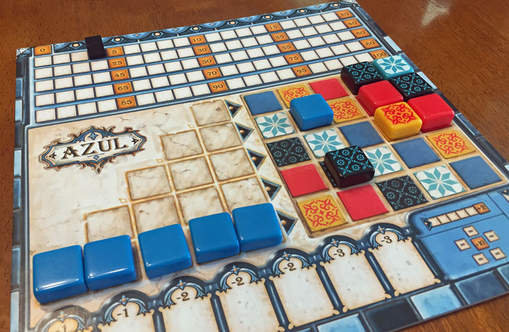

# Azul Gamebot
Currently attempting to build a bot that utilises a minmax approach for calculating the best option of tiles to take in every round of azul.

## What is Azul?

You can find out more here: https://boardgamegeek.com/boardgame/230802/azul

## How does the algorithm work?
(More detail will be posted once it is completed, tested and utilised in non idealistic settings)
